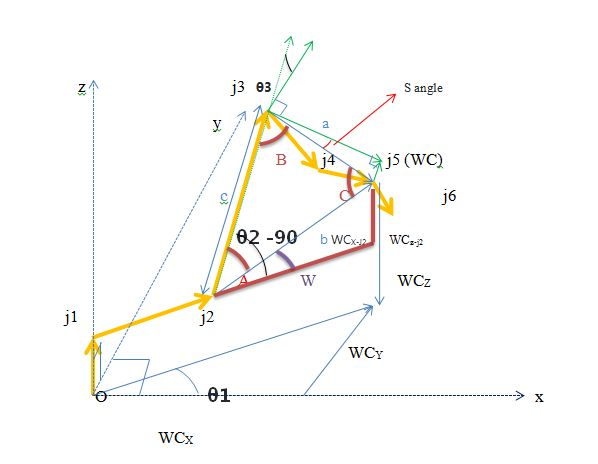
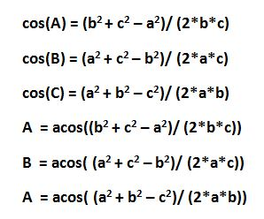

[](https://www.udacity.com/robotics)
# Robotic arm - Pick & Place project
## Using KUKA KR210 Robot

### Writeup by Thai Vin  Nguyen
### May 2018

**Steps to complete the project:**

1. Set up your ROS Workspace.
2. Download or clone the [project repository](https://github.com/udacity/RoboND-Kinematics-Project) into the ***src*** directory of your ROS Workspace.
3. Experiment with the forward_kinematics environment and get familiar with the robot.
4. Launch in [demo mode](https://classroom.udacity.com/nanodegrees/nd209/parts/7b2fd2d7-e181-401e-977a-6158c77bf816/modules/8855de3f-2897-46c3-a805-628b5ecf045b/lessons/91d017b1-4493-4522-ad52-04a74a01094c/concepts/ae64bb91-e8c4-44c9-adbe-798e8f688193).
5. Perform Kinematic Analysis for the robot following the [project rubric](https://review.udacity.com/#!/rubrics/972/view).
6. Fill in the `IK_server.py` with your Inverse Kinematics code.

[//]: # (Image References)

[image1]: ./misc_images/KR210_1.jpg
[image2]: ./misc_images/KR210_2.jpg
[image3]: ./misc_images/fw_tf_1.jpg
[image4]: ./misc_images/fw_tf_2.jpg
[image5]: ./misc_images/fw_tf_3.jpg
[image6]: ./misc_images/WC.jpg
[image7]: ./misc_images/geometry.JPG
[image8]: ./misc_images/coslaw.JPG
[image9]: ./misc_images/test_case_1.JPG
[image10]: ./misc_images/test_case_2.JPG
[image11]: ./misc_images/test_case_3.JPG
[image12]: ./misc_images/my_result.jpg

## [Rubric](https://review.udacity.com/#!/rubrics/972/view) Points
### Here I will consider the rubric points individually and describe how I addressed each point in my implementation.

---
### Writeup / README

#### 1. Provide a Writeup / README that includes all the rubric points and how you addressed each one.  You can submit your writeup as markdown or pdf.

You're reading it!

## Setting up ROS environment:
Make sure you are using robo-nd VM or have Ubuntu+ROS installed locally.

I have used the following environment to run this project:

* Ubuntu 16.04 LTS OS
* ROS Kinetic
* Gazebo 7.8.1
* RVIZ version 1.12.10 (Qt version 5.5.1 & OGRE version 1.9.0)

### installation steps:

* Clone this repository into your **src** directory:
```sh
$ cd ~/catkin_ws/src
$ git clone https://github.com/mkhuthir/RoboND-Kinematics-Project.git
```
* Install missing ROS dependencies using the `rosdep` install command:
```sh
$ cd ~/catkin_ws/
$ rosdep install --from-paths src --ignore-src --rosdistro=kinetic -y
```
* As this project uses custom Gazebo 3D models, we need to add the path through environment variable: 
```sh
$ echo "export GAZEBO_MODEL_PATH=~/catkin_ws/src/RoboND-Kinematics-Project/kuka_arm/models" >> ~/.bashrc
```
* Run the following shell commands to source the setup files:
```sh
$ echo "source ~/catkin_ws/devel/setup.bash" >> ~/.bashrc
```

* Run catkin_make from within your workspace to build the project:
```sh
$ cd ~/catkin_ws/
$ catkin_make
```
* For demo mode make sure the demo flag is set to `true` in `inverse_kinematics.launch` file under `~/catkin_ws/src/kuka_arm/launch/`

* You can also control the spawn location of the target object in the shelf by modifying the spawn_location argument in `target_description.launch` file under `~/catkin_ws/src/kuka_arm/launch/`. 0-9 are valid values for spawn_location with 0 being random mode.

* To run forward kinematics test us:
```sh
$ roslaunch kuka_arm forward_kinematics.launch
```
* To run simulator use:
```sh
$ cd ~/catkin_ws/src/RoboND-Kinematics-Project/kuka_arm/scripts
$ ./safe_spawner.sh
```

* To run IK Server use:
```sh
$ rosrun kuka_arm IK_server.py
```

## Forward Kinematic Analysis

### Extracting joint positions and orientations from URDF file.

From the URDF file `kr210.urdf.xacro` we can extract the position xyz and orientation rpy of each joint from **origin** tag in each joint XML section:

For example:

```xml
 <!-- joints -->
  <joint name="fixed_base_joint" type="fixed">
    <parent link="base_footprint"/>
    <child link="base_link"/>
    <origin xyz="0 0 0" rpy="0 0 0"/>
  </joint>
```
We can see that **xyz="0 0 0"** and **rpy="0 0 0"**.

Following table is showing complete extracted list for all joints base to gripper:

O | joint | parent | child | x | y | z | r | p | y |
--- | --- | --- | --- | --- | --- | --- | --- | --- | --- |
0 | fixed_base | base_footprint | base_link | 0 | 0 | 0 | 0 | 0 | 0 |
1 | joint_1 | base_link | link_1 | 0 | 0 | 0.33 | 0 | 0 | 0 |
2 | joint_2 | link_1 | link_2 | 0 .35| 0 | 0.42 | 0 | 0 | 0 |
3 | joint_3 | link_2 | link_3 | 0 | 0 | 1.25 | 0 | 0 | 0 |
4 | joint_4 | link_3 | link_4 | 0.96 | 0 | -0.054 | 0 | 0 | 0 |
5 | joint_5 | link_4 | link_5 | 0.54 | 0 | 0 | 0 | 0 | 0 |
6 | joint_6 | link_5 | link_6 | 0.193 | 0 | 0 | 0 | 0 | 0 |
7 | gripper | link_6 | gripper_link | 0.11 | 0 | 0 | 0 | 0 | 0 |

Now using the above table we can draw the different frames with x and z translations from one frame to another.

<p align="center">  </p>

<p align="center">  </p>

(Source: **Udacity/Robotics Software Engineer Nanodegree Program**)

#### Note that:

**Origin** O(i) = intersection between Xi and Zi axis

**Link Length:** a(i-1) = Zi-1 - Zi along the X(i-1) axis

**Link Offset:** d(i) = X(i-1) - X(i) along Z(i) axis

**Link Twist:** alpha(i-1) = angle from Z(i-1) to Z(i) measured about Xi-1 using right hand rule

**Joint Angle:** theta(i) = angle from X(i-1) to X(i) measured about Zi using right hand rule. all joint angles will be zero at initial Robot state in KR210 except joint 2 which has a -90 degree constant offset between X(1) and X(2).

### Kuka KR210 robot DH parameters

We can generate the DH parameters table as following:

Links | i | alpha(i-1) | a(i-1) | d(i) | theta(i) |
:---: | :---: | :---: | :---: | :---: | :---: |
0->1 | 1 | 0 | 0 | 0.75 | q1 |
1->2 | 2 | -90 | 0.35 | 0 | -90+q2 |
2->3 | 3 | 0 | 1.25 | 0 | q3  |
3->4 | 4 | -90 | -0.054 | 1.5 | q4 |
4->5 | 5 | 90 | 0 | 0 | q5 |
5->6 | 6 | -90 | 0 | 0 | q6 |
6->7 | 7 | 0 | 0 | 0.303 | q7 |

I will be using python to code the forward kinematics:

To start with, we need the following imports:


```python
import numpy as np
from numpy import array
from sympy import symbols, cos, sin, pi, simplify, sqrt, atan2, pprint
from sympy.matrices import Matrix
```

Python code to represent DH parameters table is:

```python
# DH Table
s = {alpha0:      0, a0:      0, d1:  0.75, q1:        q1,
     alpha1: -pi/2., a1:   0.35, d2:     0, q2: -pi/2.+q2,
     alpha2:      0, a2:   1.25, d3:     0, q3:        q3,
     alpha3: -pi/2., a3: -0.054, d4:   1.5, q4:        q4,
     alpha4:  pi/2., a4:      0, d5:     0, q5:        q5,
     alpha5: -pi/2., a5:      0, d6:     0, q6:        q6,
     alpha6:      0, a6:      0, d7: 0.303, q7:         0}
```
### Creating the individual transformation matrices about each joint:

Using above DH parameter table, we can create individual transforms between various links. DH convention uses four individual transforms:

<p align="center">  </p>

Using the DH parameter table, we can transform from one frame to another using the following matrix:

<p align="center">  </p>

Python code for a function that will return the individual frame transformation matrix is as following:

```python
## Function to return homogeneous transform matrix
def TF_Mat(alpha, a, d, q):
    TF = Matrix([[            cos(q),           -sin(q),           0,             a],
                 [ sin(q)*cos(alpha), cos(q)*cos(alpha), -sin(alpha), -sin(alpha)*d],
                 [ sin(q)*sin(alpha), cos(q)*sin(alpha),  cos(alpha),  cos(alpha)*d],
                 [                 0,                 0,           0,             1]])
    return TF
```

Then using the following code to substitute the DH parameters into the transformation matrix:

```python
 ## Substitute DH_Table
T0_1 = TF_Mat(alpha0, a0, d1, q1).subs(DH)
T1_2 = TF_Mat(alpha1, a1, d2, q2).subs(DH)
T2_3 = TF_Mat(alpha2, a2, d3, q3).subs(DH)
T3_4 = TF_Mat(alpha3, a3, d4, q4).subs(DH)
T4_5 = TF_Mat(alpha4, a4, d5, q5).subs(DH)
T5_6 = TF_Mat(alpha5, a5, d6, q6).subs(DH)
T6_7 = TF_Mat(alpha6, a6, d7, q7).subs(DH)

```
This is all transforms from base to gripper:

```python
# Composition of Homogeneous Transforms
# Transform from Base link to end effector (Gripper)
T0_2 = (T0_1 * T1_2)
T0_3 = (T0_2 * T2_3)
T0_4 = (T0_3 * T3_4)
T0_5 = (T0_4 * T4_5)
T0_6 = (T0_5 * T5_6)
T0_7 = (T0_6 * T6_7) ## Base Link_0 to Link_7 (End Effector)
```
we need to rotate around y then around z axis in order to apply correction needed to account for Orientation Difference Between definition of Gripper Link_7

```python
R_y = Matrix([[ cos(-np.pi/2),           0, sin(-np.pi/2), 0],
              [             0,           1,             0, 0],
              [-sin(-np.pi/2),           0, cos(-np.pi/2), 0],
              [             0,           0,             0, 1]])

R_z = Matrix([[    cos(np.pi), -sin(np.pi),             0, 0],
              [    sin(np.pi),  cos(np.pi),             0, 0],
              [             0,           0,             1, 0],
              [             0,           0,             0, 1]])
R_corr = (R_z * R_y)

T_total= (T0_7 * R_corr)
```
To check results we can evaluate the individual results when all thetas are equal to zero and compare it to rviz simulator values. I have used pretty print (pprint) to show the resulting matrix as shown in below code.

```python
### Numerically evaluate transforms (compare this to output of tf_echo/rviz)

print("\nT0_7 = \n")
pprint(T0_7.evalf(subs={q1: 0, q2: 0, q3: 0, q4: 0, q5: 0, q6: 0}))

```
That the homogeneous transform consists of a rotation part and a translation part as follows:

<p align="center">  </p>

where Px, Py, Pz represent the position of end-effector w.r.t. base_link and RT represent the rotation part using the Roll-Pitch-Yaw angles

Python code for forward kinematics test `FK_kr210.py` is located on this link (**./Forward_Kinematics.py**)

## Inverse Kinematics Analysis

### Inverse Position

First step is to get the end-effector position(**Px, Py, Pz**) and orientation (**Roll, Pitch, Yaw**) from the test cases data class as shown in below code:

```python
# Requested end-effector (EE) position
px = req.poses[x].position.x
py = req.poses[x].position.y
pz = req.poses[x].position.z

# Store EE position in a matrix
EE = Matrix([[px],
             [py],
             [pz]])

# Requested end-effector (EE) orientation
roll,pitch,yaw = tf.transformations.euler_from_quaternion(
        [req.poses[x].orientation.x,
         req.poses[x].orientation.y,
         req.poses[x].orientation.z,
         req.poses[x].orientation.w])
```
We substitute the obtained roll, pitch and yaw in the final rotation matrix. And calculate **WC** (position of wrist center (Wx, Wy, Wz), is allocated joint 5). This is what calculate WC:

<p align="center">  </p>

```python
 # Find EE rotation matrix RPY (Roll, Pitch, Yaw)
    r,p,y = symbols('r p y')

    # Roll
    ROT_x = Matrix([[       1,       0,       0],
                    [       0,  cos(r), -sin(r)],
                    [       0,  sin(r),  cos(r)]])
    # Pitch
    ROT_y = Matrix([[  cos(p),       0,  sin(p)],
                    [       0,       1,       0],
                    [ -sin(p),       0,  cos(p)]])
    # Yaw
    ROT_z = Matrix([[  cos(y), -sin(y),       0],
                    [  sin(y),  cos(y),       0],
                    [       0,       0,       1]])

    ROT_EE = ROT_z * ROT_y * ROT_x

    # Correction Needed to Account for Orientation Difference Between
    # Definition of Gripper Link_G in URDF versus DH Convention

    ROT_corr = ROT_z.subs(y, radians(180)) * ROT_y.subs(p, radians(-90))

    ROT_EE = ROT_EE * ROT_corr
    ROT_EE = ROT_EE.subs({'r': roll, 'p': pitch, 'y': yaw})
    # Calculate Wrest Center
    WC = EE - DH[d7] * ROT_EE[:,2]
```

We will calculate theta1, theta2, theta3 by geometry method.

<p align="center">  </p>

And use **Cosine Laws**

<p align="center">  </p>

Create function to calculate **theta1, theta2, theta3**.

The same in Python code:

 ```python
    A = acos((b**2 + c**2 - a**2) / (2*b*c))        # angle A
    B = acos((a**2 + c**2 - b**2) / (2*a*c))        # angle B
    C = acos((a**2 + b**2 - c**2) / (2*a*b))        # angle C
```

```python
def Calculate_theta_1_2_3(WC):
    global DH
    WCx, WCy, WCz = WC[0], WC[1], WC[2]

    # Calculate theta1
    theta1 = atan2(WCy,WCx)

    WCz_j2 = WCz - DH[d1]                           # WC z-component from j2
    WCx_j2 = sqrt(WCx**2 + WCy**2) - DH[a1]         # WC x-component from j2
    a = round(sqrt(DH[d4]**2 + DH[a3]**2), 7)       # line segment: j3-WC
    b = sqrt(WCx_j2**2 + WCz_j2**2)                 # line segment: j2-WC
    c = DH[a2]                                      # link length:  j2-j3

    A = acos((b**2 + c**2 - a**2) / (2*b*c))        # angle A
    B = acos((a**2 + c**2 - b**2) / (2*a*c))        # angle B
    C = acos((a**2 + b**2 - c**2) / (2*a*b))        # angle C

    # The sag between joint-3 and WC is due to a3 and its angle is formed
    # between y3-axis and side_a
    S = round(atan2(abs(DH[a3]),DH[d4]), 7) # angle S

    # Calculate theta2, theta3
    theta2 = pi/2 - A - atan2(WCz_j2, WCx_j2)
    theta3 = pi/2 - (B + S)

    return theta1, theta2, theta3
```
### Inverse Orientation
We need to calculate **theta4, theta5, theta6** by algebraic method from rotation matrix

```python
def Calculate_theta_4_5_6(T0_1,T1_2,T2_3,ROT_EE,theta1,theta2,theta3,q1,q2,q3):
    # Respective individual link Transforms
    R0_1 = T0_1[0:3, 0:3]
    R1_2 = T1_2[0:3, 0:3]
    R2_3 = T2_3[0:3, 0:3]

    # Extract rotation matrix R0_3 from transformation matrix T0_3
    R0_3 = R0_1*R1_2*R2_3
    R0_3 = R0_3.evalf(subs={q1: theta1, q2: theta2, q3:theta3})

    # Get rotation matrix R3_6 from (transpose of R0_3 * ROT_EE)
    R3_6 = R0_3.transpose() * ROT_EE
    """
    R3_6 is the composite rotation matrix formed from an extrinsic:
    R3_6[1, 0]  # sin(theta5)*cos(theta6)
    R3_6[1, 1]  # -sin(theta6)*sin(theta6)
    R3_6[0, 2]  # -sin(theta5)*cos(theta4)
    R3_6[1, 2]  # cos(theta5)
    R3_6[2, 2]  # sin(theta4)*sin(theta5)
    """
    # Calculate theta5
    theta5 = atan2(sqrt(R3_6[0,2]*R3_6[0,2] + R3_6[2,2]*R3_6[2,2]),R3_6[1,2])

    # Calculate theta5, theta6 and select best solution.
    if (theta5 > pi) :
        theta4 = atan2(-R3_6[2,2], R3_6[0,2])
        theta6 = atan2(R3_6[1,1],-R3_6[1,0])
    else:
        theta4 = atan2(R3_6[2,2], -R3_6[0,2])
        theta6 = atan2(-R3_6[1,1],R3_6[1,0])

    return theta4, theta5, theta6
```
We also have added to the forward kinematics code to help in checking for errors. Python code for forward kinematics test `IK_debug.py` is located on this link](./src/IK_debug.py

```python
FK = T0_7.evalf(subs={q1:theta1,q2:theta2,q3:theta3,q4:theta4,q5:theta5,q6:theta6})
```
### Test Case 1 output:

<p align="center">  </p>

### Test Case 2 output:

<p align="center">  </p>

### Test Case 3 output:

<p align="center">  </p>

### Steps to project implementation

* Copied the relevant functions/code from `IK_debug.py` to `IK_server.py`. Python code for forward kinematics test `IK_server.py` is located on this link](./src/RoboND-Kinematics-Project/kuka_arm/scripts/IK_server.py

* Modified the shell script `safe_spawner.sh` to include automatic run of `IK_server.py`

* Changed the launch file `inverse_kinematics.launch` to set "demo" value to "false"

### My results
I run code and my robot arm can complete 10/10 cycle.

<p align="center">  </p>

### Issues during project

* Gazebo was crashing frequently. I think VMWare of configuration not suitable, handling VMWare virtual machine image was difficult and a part of my CPU configuration is not good.

* When I use "continue" in RViz, It doesn't give the gripper enough time to close and isn't picking up the cylinder. I have added a delay in line 327 in the /src/trajectory_sampler.cpp file.
* Calculatting to the forward and inverse kinematics is slow.

### Need to improve to better in future

* I can use my CPU configuration very well to Gazebo will not crash frequently.

* Improve algorithm to calculate the forward and inverse kinematics is faster than.

* Moreover, I think performance of IK will be much better if we converted some or all of the code parts from sympy to numpy.


